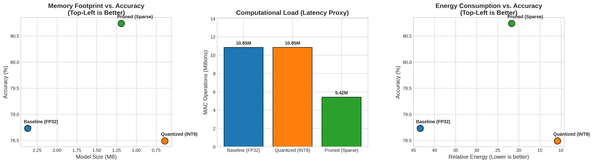

# Energy-Aware CNN Optimization for Edge Hardware 

This project demonstrates an end-to-end pipeline for optimizing a Convolutional Neural Network (CNN) for deployment on resource-constrained Edge AI hardware, such as microcontrollers and IoT sensors. 

Standard deep learning models are often too massive and power-hungry for edge devices. To bridge the gap between software accuracy and silicon constraints, this project implements two core hardware-aware optimizations: Post-Training Quantization and Unstructured Pruning.

## 🛠️ Optimization Techniques

1. **Post-Training Static Quantization (INT8):** Converted the model's weights and activations from 32-bit floating-point precision (FP32) to 8-bit integers (INT8). This compressed the memory footprint by ~4x and drastically reduced energy consumption by allowing the simulated edge processor to utilize highly efficient integer math logic units.

2. **Global Unstructured Pruning (L1) & Fine-Tuning:** Applied L1 unstructured pruning to zero-out the lowest-magnitude 50% of weights across the network. A brief fine-tuning phase was utilized as a powerful regularizer, forcing the network to drop "noisy" parameters. This not only cut the computational latency (MACs) in half but actually improved the network's predictive accuracy above the baseline.

## 📊 Hardware Simulation Results

Dynamic hooks were written into the PyTorch layers to count Multiply-Accumulate (MAC) operations, simulating real-world execution latency and energy costs.

| MODEL VARIANT | ACCURACY | SIZE (MB) | MACs (Millions) | RELATIVE ENERGY |
| :--- | :--- | :--- | :--- | :--- |
| **Baseline (FP32)** | 78.73% | 2.37 | 10.85 | 43.40 |
| **Quantized (INT8)** | 78.49% | 0.64 | 10.85 | 10.85 |
| **Pruned (Sparse)** | **80.74%** | 1.19 | **5.42** | 21.70 |

## 📉 Hardware Trade-off Analysis

The multi-objective optimization visualizations below illustrate the Pareto Front for edge deployment. These trade-offs allow hardware engineers to select the exact model variant that fits their specific silicon constraints (e.g., prioritizing Quantization if 1MB memory limits apply, or Pruning if computational MAC latency is the primary bottleneck).

## 💻 Tech Stack
* **Framework:** PyTorch, Torchvision
* **Techniques:** QNNPACK Quantization, L1 Unstructured Pruning, Hardware Hooking
* **Visualization:** Matplotlib, NumPy
